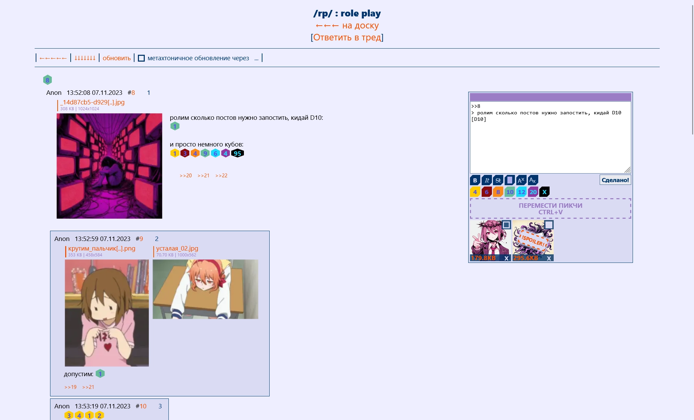
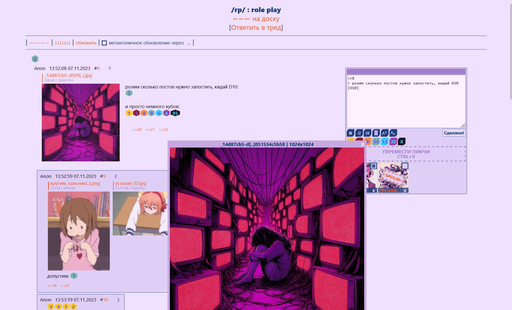

###### hi! I mean sowwy for bad English.

# About
Anonymous imageboard with [backend](/back/server/src/) in Rust and [frontend](/front/vue_x/src/) in Vue.

# Getting Started
You should have `cargo`(`Rust`), `npm` and `Python 3`*1 installed.

First of all we need to build frontend: 

1. `cd ./front/vue_x/` : open [frontend folder](/front/vue_x/)
1. `npm install` : install dependencies
1.  `npm run build` : build frontend

Then build backend:

4. `cd ../../` : return to repo root folder
4. `cd ./back/server/` : open [backend folder](/back/server/)
4. `cargo run -r` : build and run backend

If you need you can also auto create some threads and posts:

7. `cd ./test/REST/` : open [backend REST test folder](/back/server/test/REST/)
8. for example `python ./create_a.py` : create a thread on `/a/` board and make some posts there (no pics) 

Backend config can be changed [here](/back/server/Config.toml).

###### *1: `Python 3` only used on frontend building and it's need only to save users' posted pics between rebuilding frontend. So if you don't need to save it then just remove in [frontend config file](/front/vue_x/package.json) `"prebuild"` and `"postbuild"` script commands. And after it there will be no `Python 3` dependencies.

# How it looks

thread example

 

pic view example

# Some other docs
* [Text preprocessors](/back/server/src/preproc/preproc.md) : doc about `[D10]`, `>>` and so on
